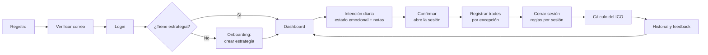
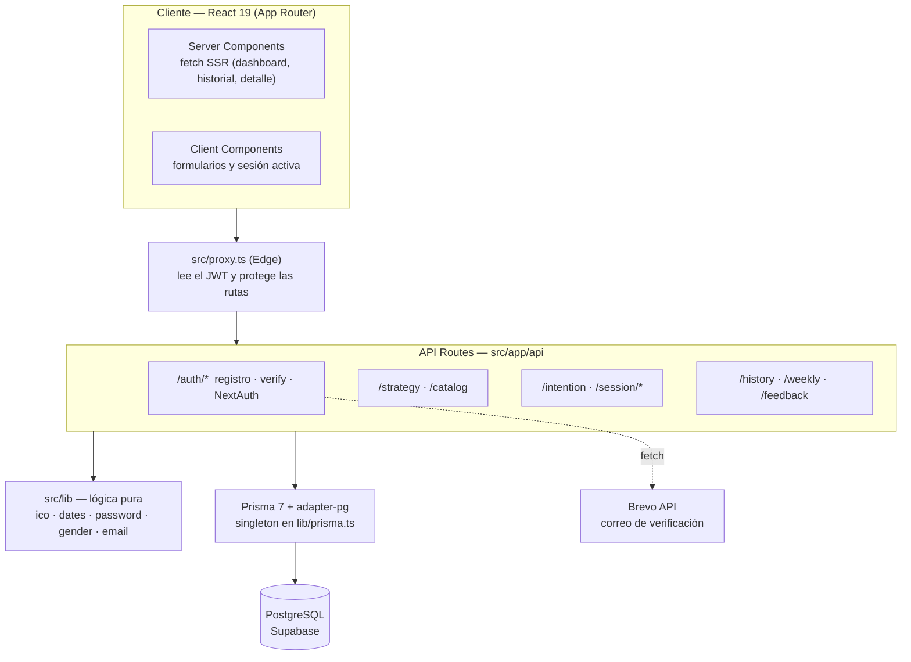
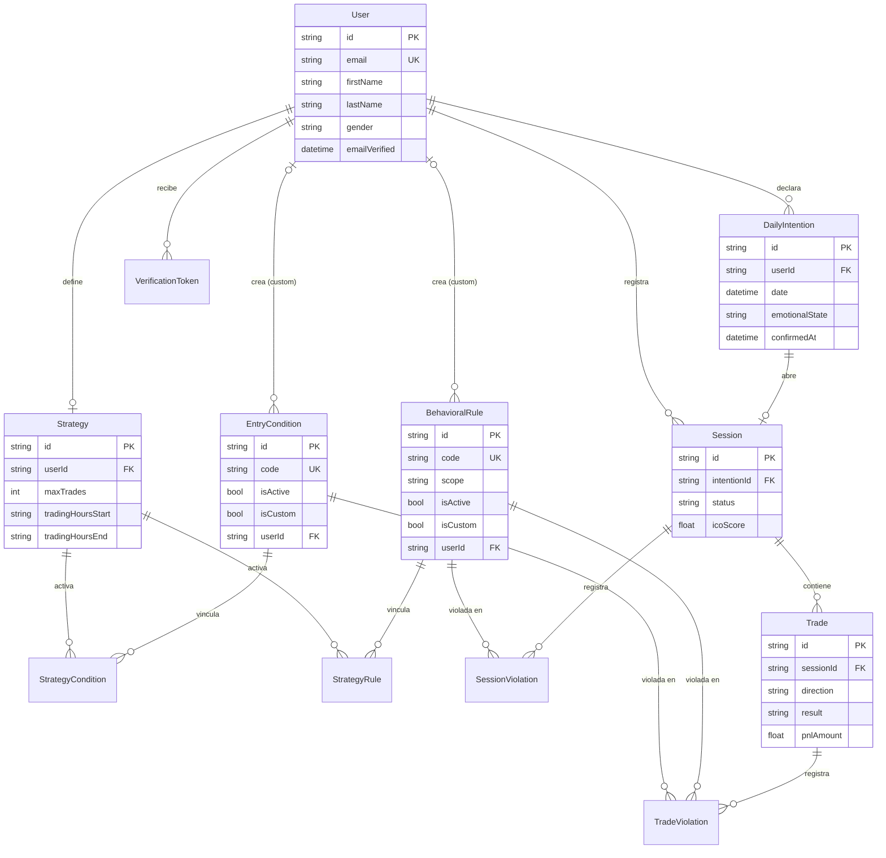

<div align="center">


# KOSMOS

**Mide la disciplina, no el resultado.**
Plataforma de análisis conductual para traders novatos basada en el **ICO — Índice de Coherencia Operativa**.

[](https://nextjs.org)
[](https://react.dev)
[](https://www.typescriptlang.org)
[](https://www.prisma.io)
[](https://supabase.com)
[](https://vercel.com)

</div>

> Trabajo Fin de Grado de **Santiago Fuenmayor**.

---

## Tabla de contenidos

- [¿Qué es Kosmos?](#qué-es-kosmos)
- [Funcionalidades](#funcionalidades)
- [Flujo de uso](#flujo-de-uso)
- [El ICO](#el-ico-índice-de-coherencia-operativa)
- [Catálogo de condiciones y reglas](#catálogo-de-condiciones-y-reglas)
- [Stack tecnológico](#stack-tecnológico)
- [Arquitectura](#arquitectura)
- [Modelo de datos](#modelo-de-datos)
- [API REST](#api-rest)
- [Autenticación y seguridad](#autenticación-y-seguridad)
- [Puesta en marcha](#puesta-en-marcha)
- [Variables de entorno](#variables-de-entorno)
- [Scripts](#scripts)
- [Testing y calidad](#testing-y-calidad)
- [Despliegue](#despliegue)
- [Estructura del repositorio](#estructura-del-repositorio)
- [Decisiones de diseño](#decisiones-de-diseño)
- [Limitaciones conocidas](#limitaciones-conocidas)

---

## ¿Qué es Kosmos?

La mayoría de los traders novatos no pierden por falta de conocimiento técnico, sino por **falta de disciplina**: improvisan entradas, mueven el stop-loss, operan fuera de horario, se dejan llevar por el FOMO o intentan recuperar una pérdida con una operación de venganza.

Kosmos ataca ese problema desde otro ángulo. En lugar de medir cuánto dinero se gana o se pierde, mide la **brecha entre la estrategia que el trader declaró y la operativa que realmente ejecutó**, y la resume en un único número: el **ICO**. A lo largo del tiempo, el sistema detecta patrones de comportamiento —la regla más violada, la relación entre estado emocional y disciplina, el "talón de Aquiles" recurrente— y los devuelve al trader como retroalimentación accionable.

> Un trader puede perder dinero y tener un ICO alto (siguió su plan), o ganar dinero con un ICO bajo (tuvo suerte). Kosmos premia lo primero.

## Funcionalidades

| Área | Qué ofrece |
|---|---|
| **Onboarding** | Flujo guiado de 2 pasos que obliga a crear la estrategia antes de usar la app: sin plan no hay nada contra lo que medir el ICO. |
| **Estrategia** | Límites operativos (máx. operaciones y horario), condiciones de entrada y reglas conductuales activables una a una. Permite crear **condiciones y reglas personalizadas** privadas y eliminarlas. Se bloquea mientras hay una sesión abierta. |
| **Intención diaria** | Barrera de reflexión previa: el trader declara su estado emocional y notas, revisa su plan y **confirma** para abrir sesión. Los límites se heredan de la estrategia y no se pueden alterar ese día. |
| **Sesión activa** | **Registro por excepción**: todo se asume cumplido y solo se marca lo incumplido. Contadores en tiempo real y cierre deliberado con revisión de reglas por sesión. |
| **Dashboard** | Anillo de ICO del día, evolución semanal, calendario mensual, estadísticas de sesión y una frase diaria. |
| **Historial** | Navegación por meses, detalle de cada sesión y **feedback conductual** generado con los datos reales del trader. |
| **Cuenta** | Registro con verificación de correo (Brevo), política de contraseñas y textos con concordancia de género. |
| **Interfaz** | Diseño *glassmorphism* sobre un fondo WebGL animado, responsive y optimizado para iOS Safari. |

## Flujo de uso



1. **Configura su estrategia** — elige del catálogo (o crea las suyas) las condiciones de entrada y reglas conductuales a las que se compromete, y fija máximo de operaciones y horario.
2. **Declara la intención del día** — estado emocional (`NEUTRAL`, `ANXIOUS`, `CONFIDENT`, `FRUSTRATED`, `TIRED`) y notas libres.
3. **Confirma para abrir la sesión** — sin confirmación no se puede operar.
4. **Registra los trades por excepción** — dirección, resultado, activo, P&L y solo las condiciones/reglas que incumplió.
5. **Cierra la sesión** — revisa las reglas por sesión y el sistema calcula el ICO de forma atómica.
6. **Consulta su evolución** — ICO semanal, calendario mensual e insights.

## El ICO (Índice de Coherencia Operativa)

Las fórmulas viven en [`src/lib/ico.ts`](src/lib/ico.ts) como **funciones puras** (sin Prisma ni DOM) y están cubiertas por tests unitarios.

### ICO diario

Se calcula al cerrar la sesión en [`/api/session/close`](src/app/api/session/close/route.ts):

```
Rs  = (Ts × C_activas) + (Ts × R_trade) + R_session      # instancias evaluables
Vs  = violaciones por trade + violaciones de sesión       # incumplimientos
ICO = clamp(1 − Vs / Rs, 0, 1)
```

| Símbolo | Significado |
|---|---|
| `Ts` | Nº de trades registrados en la sesión |
| `C_activas` | Condiciones de entrada activas en la estrategia |
| `R_trade` | Reglas conductuales `PER_TRADE` activas |
| `R_session` | Reglas conductuales `PER_SESSION` activas |

- Si `Rs = 0` (nada que evaluar) el ICO es **1** por convención: no se mide, pero tampoco se penaliza.
- El resultado se acota a `[0, 1]` y se redondea a 4 decimales.

**Ejemplo.** 3 trades, 4 condiciones activas, 3 reglas por trade y 1 por sesión: `Rs = 3·4 + 3·3 + 1 = 22`. Con 3 violaciones, `ICO = 1 − 3/22 ≈ 0,864` → **86 %**.

### ICO semanal

Calculado en [`/api/history/weekly`](src/app/api/history/weekly/route.ts) (semanas lunes–domingo, en UTC):

```
M        = media de los ICO diarios de la semana
σ        = desviación estándar poblacional de los ICO diarios
E        = clamp(1 − σ / 0.5, 0, 1)                      # estabilidad conductual
ICO_sem  = 0.70 × M + 0.30 × E
```

El factor de **estabilidad `E`** premia la consistencia sobre el rendimiento puntual. Con la misma media (0,70), una semana `70 / 70 / 70` puntúa **0,79** y una semana `100 / 40 / 70` solo **0,64**.

## Catálogo de condiciones y reglas

Sembrado por [`prisma/seed.ts`](prisma/seed.ts). Cada usuario activa las que aplican a su metodología y puede añadir las suyas.

**Condiciones de entrada** (se evalúan en cada trade)

| Código | Nombre |
|---|---|
| `TREND_CONFIRM` | Tendencia Confirmada |
| `SR_LEVEL` | Nivel S/R |
| `VOLUME_CONFIRM` | Volumen Confirmado |
| `INDICATOR_SIGNAL` | Señal de Indicador |
| `PATTERN_FORMED` | Patrón Formado |
| `RR_ACCEPTABLE` | R:R Aceptable |

**Reglas conductuales**

| Código | Nombre | Ámbito | Notas |
|---|---|---|---|
| `NO_SL_MODIFY` | Stop-Loss Respetado | `PER_TRADE` | |
| `NO_IMPULSE_ENTRY` | Entrada Deliberada | `PER_TRADE` | |
| `NO_EARLY_EXIT` | Sin Salida Prematura | `PER_TRADE` | |
| `NO_REVENGE_TRADE` | Sin Trade de Venganza | `PER_TRADE` | |
| `TRADING_HOURS` | Horario Respetado | `PER_TRADE` | **Obligatoria**; se pre-marca al operar fuera de horario |
| `MAX_TRADES_LIMIT` | Máx. Operaciones | `PER_SESSION` | **Obligatoria**; se pre-marca al superar el límite |
| `CONDITIONS_MET` | Condiciones OK | `PER_TRADE` | Desactivada: duplicaba el conteo de las condiciones de entrada |
| `STRATEGY_FOLLOWED` | Estrategia OK | `PER_SESSION` | Desactivada: imposible de violar (la estrategia está bloqueada con sesión abierta) |

Las entradas desactivadas se conservan en BD (*soft delete*, `isActive = false`) para no romper las violaciones históricas que las referencian.

## Stack tecnológico

| Capa | Tecnología |
|---|---|
| **Framework** | [Next.js 16](https://nextjs.org) (App Router, Turbopack) · [React 19](https://react.dev) |
| **Lenguaje** | TypeScript en modo `strict` |
| **Base de datos** | PostgreSQL en [Supabase](https://supabase.com) |
| **ORM** | [Prisma 7](https://www.prisma.io) con *driver adapter* `@prisma/adapter-pg` (`pg`) |
| **Autenticación** | [NextAuth.js v4](https://next-auth.js.org) (Credentials + JWT) · `bcryptjs` |
| **Correo transaccional** | [Brevo](https://www.brevo.com) vía API HTTP (`fetch`, sin SDK) |
| **Estilos** | CSS Modules + tokens de diseño en CSS variables ([`globals.css`](src/app/globals.css)) |
| **Gráficos** | [Recharts](https://recharts.org) |
| **Fondo animado** | [OGL](https://github.com/oframe/ogl) (shader WebGL) |
| **Tests** | [Vitest](https://vitest.dev) |
| **Calidad** | ESLint 9 (`eslint-config-next`) · GitHub Actions |
| **Hosting** | [Vercel](https://vercel.com) (región `fra1`, junto a Supabase) |

## Arquitectura



Las páginas se agrupan en *route groups*:

- **`(auth)`** — `/login`, `/register`, `/verify`. Públicas, sin navbar.
- **`(app)`** — `/dashboard`, `/strategy`, `/session/{new,active,[id]}`, `/history`. Protegidas por `proxy.ts`. Su `layout.tsx` actúa además como **puerta de onboarding**: si el usuario no tiene estrategia, muestra el onboarding en lugar de `children`, cubriendo todas las rutas del grupo.

> **Next.js 16:** el antiguo `middleware.ts` se llama ahora `proxy.ts`.

## Modelo de datos

Definido en [`prisma/schema.prisma`](prisma/schema.prisma) (con comentarios extensos por campo).

| Modelo | Propósito |
|---|---|
| `User` | Cuenta del trader: nombre, apellido, género, `emailVerified` y hash bcrypt. |
| `VerificationToken` | Token de confirmación de correo (único, con caducidad de 24 h). |
| `Strategy` | Plan operativo (1‑a‑1 con el usuario): `maxTrades`, `tradingHoursStart/End`. |
| `EntryCondition`, `BehavioralRule` | Catálogos. Del sistema (`isCustom = false`) o personalizados y privados (`isCustom = true`, con `userId`). `isActive` implementa el *soft delete*. |
| `StrategyCondition`, `StrategyRule` | Vínculo estrategia ↔ catálogo con `isActive` (toggle por usuario). |
| `DailyIntention` | Plan del día, único por `(userId, date)`. Copia los límites de la estrategia. Sin `confirmedAt` no hay sesión. |
| `Session` | Sesión de trading 1‑a‑1 con la intención. Estados `OPEN` / `CLOSED`; guarda `icoScore` al cerrar. |
| `Trade` | Operación: dirección, resultado, activo, P&L y notas. |
| `TradeViolation` | Incumplimiento de regla `PER_TRADE` o de condición de entrada en un trade. |
| `SessionViolation` | Incumplimiento de regla `PER_SESSION`. `@@unique([sessionId, ruleId])`. |



Un diagrama más detallado está en [`docs/er-diagram.mmd`](docs/er-diagram.mmd).

## API REST

Todos los endpoints (salvo los de `/api/auth/*`) exigen sesión y filtran siempre por el usuario autenticado.

| Método | Ruta | Descripción |
|---|---|---|
| `POST` | `/api/auth/register` | Crea la cuenta (sin verificar) y envía el correo de confirmación. |
| `POST` | `/api/auth/verify` | Canjea el token del correo. |
| `POST` | `/api/auth/resend-verification` | Reenvía el correo (respuesta uniforme, sin filtrar qué cuentas existen). |
| `*` | `/api/auth/[...nextauth]` | Login/logout gestionados por NextAuth. |
| `GET` | `/api/catalog` | Catálogo maestro de condiciones y reglas (para el onboarding). |
| `GET` `POST` `PUT` | `/api/strategy` | Leer, crear (con vinculación al catálogo) y actualizar la estrategia. |
| `POST` | `/api/strategy/conditions` · `/rules` | Crear condición / regla personalizada. |
| `PATCH` `DELETE` | `/api/strategy/conditions/[id]` · `/rules/[id]` | Activar/desactivar; eliminar (solo personalizadas). |
| `GET` `POST` | `/api/intention` | Leer / crear la intención del día. |
| `POST` | `/api/intention/confirm` | Confirma la intención y abre la sesión (transacción atómica). |
| `GET` | `/api/session/active` | Sesión abierta de hoy con trades y violaciones. |
| `POST` | `/api/session/trade` | Registra un trade con sus violaciones. |
| `POST` | `/api/session/close` | Cierra la sesión y calcula el ICO. |
| `GET` | `/api/session/[id]` | Detalle de una sesión propia. |
| `GET` | `/api/history` | Sesiones cerradas, paginadas. |
| `GET` | `/api/history/weekly?weeks=N` | ICO semanal de las últimas N semanas (1–52). |
| `GET` | `/api/history/feedback` | Insights conductuales de la semana reciente. |

## Autenticación y seguridad

- **Credentials + JWT** en cookie `httpOnly`; sin tabla de sesiones.
- **Contraseñas** con hash `bcrypt`; política compartida cliente/servidor ([`password.ts`](src/lib/password.ts)): mínimo 8 caracteres, una mayúscula y un número.
- **Verificación de correo obligatoria**: la cuenta no puede iniciar sesión hasta confirmar. Tokens de 32 bytes aleatorios, caducidad de 24 h, y los anteriores se invalidan al reenviar.
- **Anti-enumeración de usuarios**: el login no distingue "usuario inexistente" de "contraseña errónea", y `resend-verification` responde siempre igual.
- **Canje del token desde el cliente** (`/verify`), no en un `GET` del servidor, para que los antivirus o previsualizadores de enlaces no activen la cuenta.
- **Aislamiento por usuario**: cada consulta filtra por `session.user.id`; los IDs de violaciones se validan contra la estrategia del usuario para impedir inyectar IDs ajenos.
- **Integridad**: cierre de sesión y confirmación de intención en transacciones; `@@unique` en `(userId, date)` y `(sessionId, ruleId)` como invariantes a nivel de BD.

## Puesta en marcha

### Requisitos

- **Node.js 20** o superior (el CI usa Node 20; el proyecto se desarrolla con Node 22) y **npm**.
- Una base de datos **PostgreSQL**. Lo más sencillo es un proyecto gratuito de [Supabase](https://supabase.com); también sirve un Postgres local.

### Instalación

```bash
# 1. Clonar e instalar dependencias
git clone https://github.com/santifuenma/kosmos.git
cd kosmos
npm install

# 2. Configurar variables de entorno
cp .env.example .env
# Rellena DATABASE_URL, DIRECT_URL y NEXTAUTH_SECRET (ver la sección siguiente)

# 3. Crear las tablas
npx prisma migrate deploy

# 4. Sembrar los catálogos de condiciones y reglas (solo en una BD nueva)
npx prisma db seed

# 5. (Opcional) Datos de demostración con sesiones históricas
npm run seed:test

# 6. Arrancar el servidor de desarrollo
npm run dev
```

La app queda en <http://localhost:3000>. Como `npm run dev` escucha en `0.0.0.0`, también es accesible desde otros dispositivos de la LAN (ajusta `NEXTAUTH_URL` y `allowedDevOrigins` en [`next.config.ts`](next.config.ts) a tu IP).

> ⚠️ **`prisma db seed` es destructivo**: borra y recrea los catálogos, y con ellos los vínculos de estrategia y las violaciones que los referencian. Ejecútalo solo sobre una base de datos vacía.

> 📧 **Sin `BREVO_API_KEY` en desarrollo** no se envía ningún correo: el enlace de verificación se imprime en la consola del servidor y basta con pegarlo en el navegador.

## Variables de entorno

Plantilla completa y comentada en [`.env.example`](.env.example).

| Variable | Obligatoria | Descripción |
|---|:---:|---|
| `DATABASE_URL` | ✅ | Conexión de la app en runtime. En Supabase, *pooler* en modo transacción (`:6543`, con `?pgbouncer=true`). |
| `DIRECT_URL` | ✅ | Conexión directa / de sesión (`:5432`). La usa la CLI de Prisma para migraciones y seed ([`prisma.config.ts`](prisma.config.ts)). |
| `NEXTAUTH_SECRET` | ✅ | Clave de firma de los JWT. Genérala con `node -e "console.log(require('crypto').randomBytes(32).toString('hex'))"`. |
| `NEXTAUTH_URL` | ✅ | URL pública de la app. También es la base de los enlaces de verificación. |
| `BREVO_API_KEY` | En producción | API key de Brevo. Sin ella, en producción el registro falla. |
| `BREVO_FROM_EMAIL` | Con API key | Remitente **verificado** en Brevo (basta un único correo, no hace falta un dominio). |
| `BREVO_FROM_NAME` | No | Nombre visible del remitente. Por defecto `Kosmos`. |

## Scripts

| Comando | Acción |
|---|---|
| `npm run dev` | Servidor de desarrollo (Turbopack, hot reload). |
| `npm run build` | `prisma generate` + build de producción con type-check. |
| `npm run start` | Sirve el build de producción. |
| `npm run lint` | ESLint. |
| `npm test` | Tests unitarios con Vitest. |
| `npm run test:watch` | Vitest en modo *watch*. |
| `npm run seed:test` | Inserta sesiones de demostración ([`seed-test-data.ts`](prisma/seed-test-data.ts)). |
| `npx prisma migrate deploy` | Aplica las migraciones pendientes. |
| `npx prisma db seed` | Siembra los catálogos (destructivo, ver aviso). |
| `npx prisma studio` | Explorador web de la base de datos. |
| `npx tsx prisma/reset-password.ts <email> <pass>` | Restablece la contraseña de un usuario (no hay recuperación en la app). |

## Testing y calidad

- **Vitest** cubre las funciones puras de `src/lib`: fórmulas del ICO ([`ico.test.ts`](src/lib/ico.test.ts)) y utilidades de fecha ([`dates.test.ts`](src/lib/dates.test.ts)). Se prueban funciones puras a propósito: no dependen del DOM ni de Prisma, así que corren rápido y sin infraestructura.
- **ESLint** con la configuración oficial de Next.js y TypeScript en modo `strict`.
- **GitHub Actions** ([`ci.yml`](.github/workflows/ci.yml)) define un job lineal: instalar → `prisma generate` → lint → tests → build.

## Despliegue

Producción: **Vercel** (funciones fijadas a `fra1` en [`vercel.json`](vercel.json)) + **Supabase** (PostgreSQL). La guía paso a paso está en [`DEPLOY.md`](DEPLOY.md). Puntos clave:

- Configura en Vercel las variables de entorno (Production y Preview); `NEXTAUTH_URL` debe coincidir con el dominio real.
- El build ejecuta `prisma generate`, pero **no aplica migraciones**: lanza `npx prisma migrate deploy` cuando cambie el esquema.
- En runtime la app usa el *pooler* de transacción; las migraciones usan la conexión directa.

## Estructura del repositorio

```
prisma/
  migrations/           Historial SQL de cambios de esquema
  schema.prisma         Modelo de datos
  seed.ts               Catálogos del sistema
  seed-test-data.ts     Sesiones de demostración
  seed-testuser.ts      Historial jun–jul 2026 del usuario de prueba
  reset-password.ts     Utilidad de restablecimiento de contraseña
docs/
  er-diagram.mmd        Diagrama entidad-relación (Mermaid)
public/                 Logotipos, icono de la app y fondo SVG
src/
  app/
    (auth)/             login · register · verify (públicas)
    (app)/              dashboard · strategy · session · history (protegidas)
    api/                Endpoints REST (ver sección API)
    layout.tsx          Layout raíz (SessionProvider, fuentes Geist, viewport)
    page.tsx            Redirección según sesión
    globals.css         Tokens de diseño (glass, colores, radios, sombras)
  components/
    cards/              IcoCard, MonthlyCalendar, SessionStatsCard, TradesTable
    layout/             Navbar, SessionProvider
    onboarding/         OnboardingFlow (bienvenida + estrategia en 2 pasos)
    ui/                 Tooltip, ConfirmDialog
    icons/              Barrel central de iconos SVG
    LiquidBackground    Fondo WebGL animado
  lib/
    auth.ts             Configuración de NextAuth
    prisma.ts           Singleton del cliente Prisma
    ico.ts              Fórmulas del ICO (puras y testeadas)
    dates.ts            Utilidades de fecha en UTC
    email.ts            Cliente de Brevo y plantilla del correo
    verification.ts     Emisión y envío de tokens de verificación
    password.ts         Política de contraseñas
    gender.ts           Concordancia gramatical de los textos
    dailyTips.ts        Frase del día
    *.test.ts           Tests unitarios
  types/                Tipos compartidos y extensión de NextAuth
  proxy.ts              Protección de rutas (antes middleware.ts)
```

## Decisiones de diseño

- **Medir conducta, no resultado.** El ICO ignora el P&L: un día perdedor disciplinado puntúa alto.
- **Registro por excepción.** Todo se asume cumplido; solo se marca lo incumplido. Reduce la fricción justo cuando el trader está bajo presión.
- **Límites inmutables en el día.** `maxTrades` y el horario viven en la estrategia y la intención diaria los hereda: si se pudieran cambiar cada mañana, el trader no seguiría una estrategia, improvisaría.
- **Barrera de reflexión.** Sin confirmar la intención no hay sesión, y con sesión abierta la estrategia queda bloqueada.
- **Catálogo estable con *soft delete*.** Las violaciones guardan el ID del catálogo (no del vínculo por usuario) y los elementos retirados se desactivan en vez de borrarse, de modo que el historial nunca se corrompe.
- **Días en UTC.** Todo el cálculo de "hoy" y de semanas es en UTC para no depender del huso horario del cliente.
- **Fórmulas puras y aisladas.** Facilitan el testeo y permiten reutilizarlas desde API routes y Server Components.

## Limitaciones conocidas

Alcance de MVP asumido en el TFG:

- Una única estrategia por usuario y **sin versionado**: el detalle de una sesión muestra la estrategia actual, no la vigente ese día.
- Sin recuperación de contraseña desde la app (existe un script de emergencia).
- Los tokens JWT no se pueden invalidar en servidor antes de su caducidad.
- Interfaz y textos únicamente en español.

---

<div align="center">
<sub>Kosmos · Trabajo Fin de Grado · Santiago Fuenmayor</sub>
</div>
